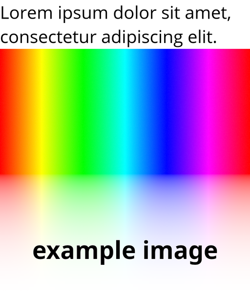

# magick-memes
memey scripts for imagemagick

# cubify

turn any image into a cube with one easy step!

USAGE: `cubify [in] [out]`

# memeify 
    
`memeify -m example.png meme.png 'TOP TEXT' 'BOTTOM TEXT'`

    
`memeify -n example.png neue.png 'Lorem ipsum dolor sit amet, consectetur adipiscing elit.'`

    
`memeify -d example.png deepfry.png`

adds "meme" captions to images, and optionally deep fries

USAGE: `memeify [-mnd] [in] [out] [top text] [bottom text]`
